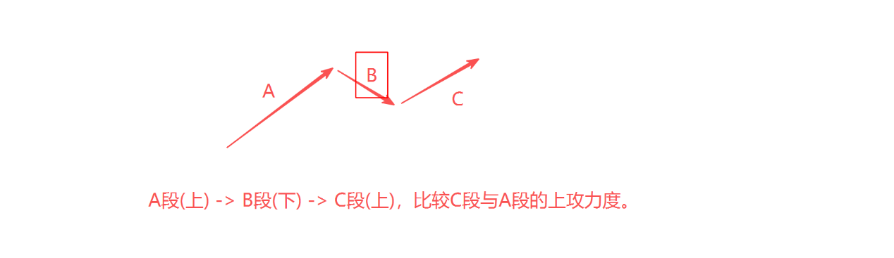
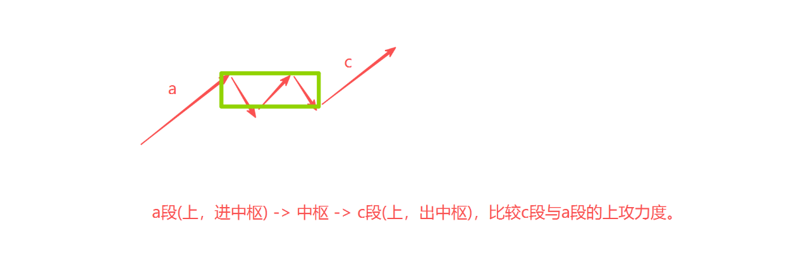
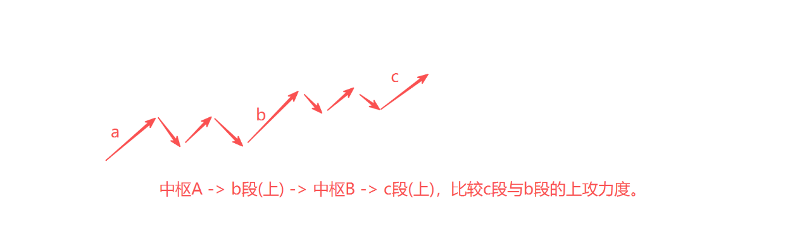
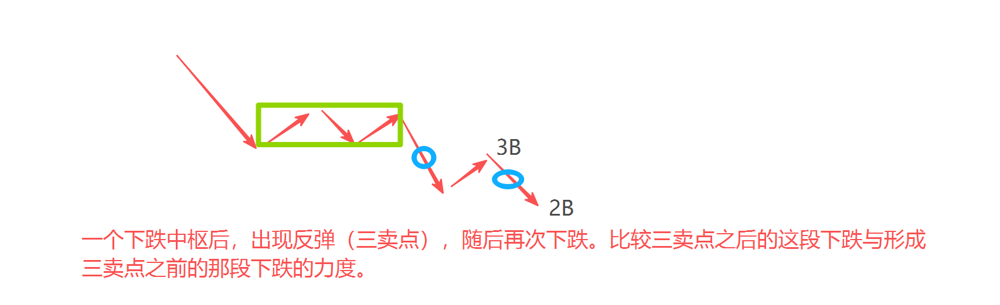
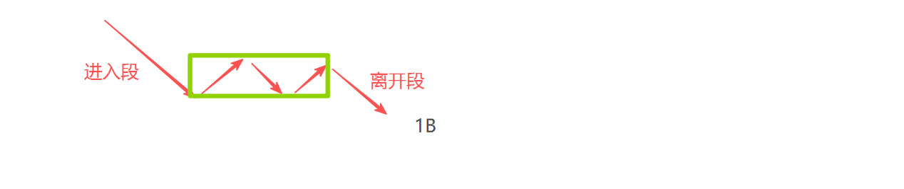
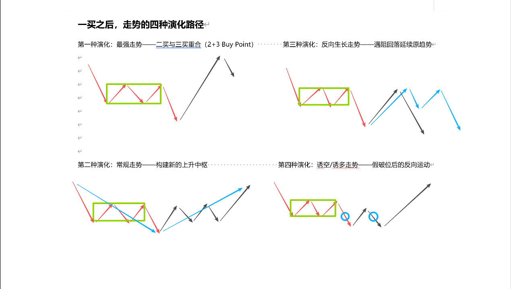
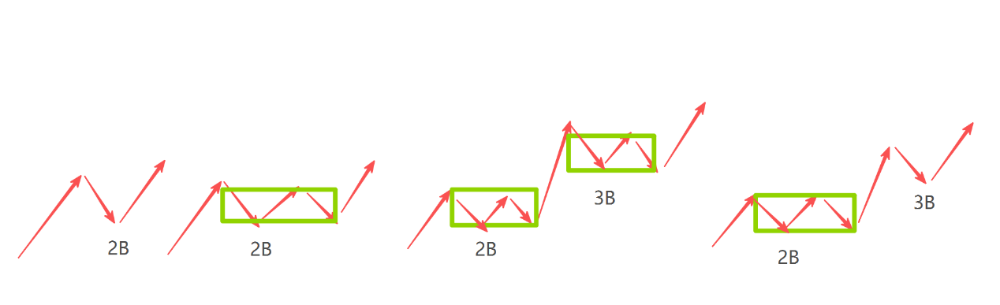
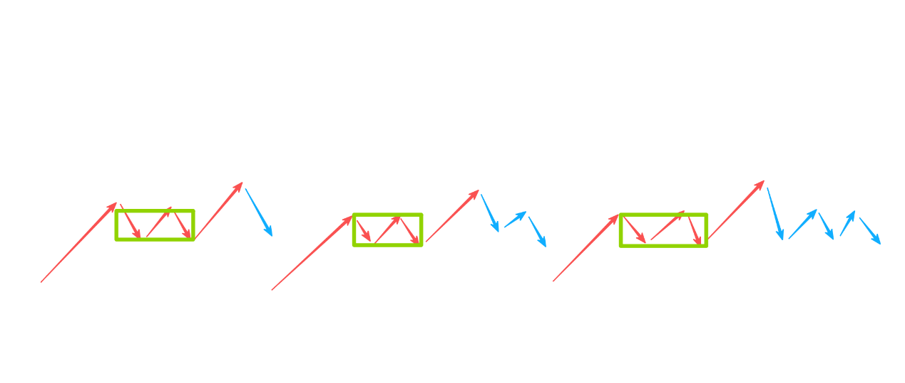
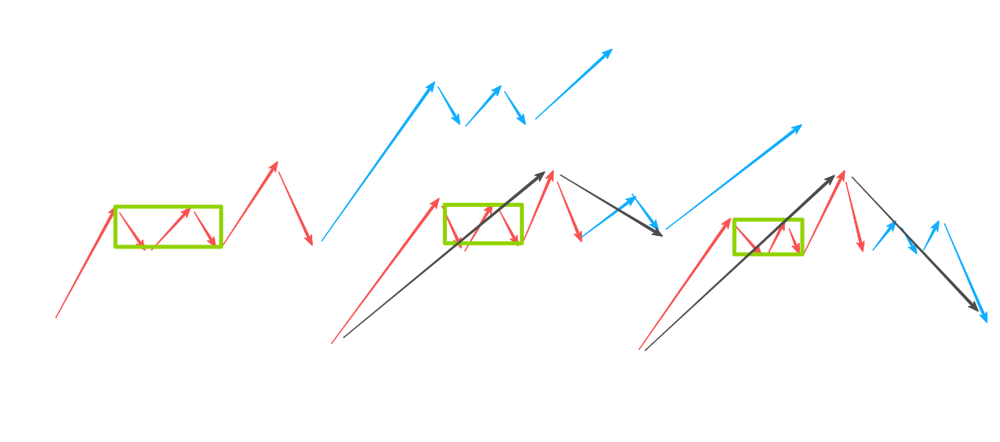

# 缠论买卖点整理稿

> 本文根据 `docs/缠论买卖点.docx` 重新组织。原文围绕三类主题展开：第一类买卖点、第二类买卖点、牛暴买点。本文按“定义 -> 识别 -> 演化 -> 操作 -> 易错点”的顺序整理，便于复盘和实战查阅。

## 0. 总览

| 主题 | 核心定位 | 关键问题 | 交易含义 |
| --- | --- | --- | --- |
| 第一类买卖点 | 原趋势的衰竭点 | 原趋势是否已经走不动？ | 左侧试探，不能等同于转折确认 |
| 第二类买卖点 | 新方向力量加入后的确认点 | 一买后是否不再创新低？ | 转折得到验证，风险比一买更低 |
| 牛暴买点 | 强势走势中的生长式回调买点 | 左侧中枢支撑是否有效？ | 博弈强势股启动或加速 |

### 术语速查

| 术语 | 整理定义 |
| --- | --- |
| 中枢 | 多空力量反复争夺形成的重叠区间，是买卖点定位的核心参照物。 |
| 最后中枢 | 产生一买前，距离当前最近的同级别下跌中枢。后续反弹强弱主要看它的上轨和下轨。 |
| 一买 | 下跌趋势背驰后的买点，本质是空头衰竭，不是多头确认。 |
| 一卖 | 上涨趋势背驰后的卖点，与一买方向相反。 |
| 二买 | 一买后反弹，再回调不破一买低点形成的买点，本质是多头加入后的确认。 |
| 类二买 | 新生上涨中枢内部的回踩买点，逻辑类似二买，但属于趋势延续或中枢震荡过程。 |
| 三买 | 离开中枢后回抽不回中枢形成的买点，是趋势延续确认。 |
| 2+3 买点 | 同时具备二买和三买含义的强势买点，通常代表趋势启动确认。 |
| 牛暴 | 有左侧中枢支撑、回调结构较温和、满足强势筛选条件的生长式买点。 |
| 熊暴 | 牛暴结构放大一个级别后的更大级别强势买点。名称不是关键，关键是级别升级。 |

## 1. 第一类买卖点：趋势衰竭点

### 1.1 核心定义

第一类买卖点产生于趋势走势出现背驰的位置。

- 一买：下跌趋势背驰后的买点。
- 一卖：上涨趋势背驰后的卖点。
- 核心本质：它是“衰竭点”，不是“转折点”。

一买只说明原有下跌动能衰竭，不能直接证明上涨趋势已经开始。它属于左侧预警信号，交易上必须搭配后续走势分类和仓位管理。

### 1.2 背驰的四种结构比较

背驰的本质是同一方向相邻走势段的力度减弱。MACD 的面积、高度、黄白线高度可以辅助判断，但最终要回到走势结构。

| 结构 | 比较对象 | 判断重点 |
| --- | --- | --- |
| 三段上/下结构 | 第 3 段与第 1 段 | C 段力度弱于 A 段，则可能背驰。 |
| 盘整上/下结构 | 离开中枢的 c 段与进入中枢的 a 段 | 盘整背驰通常级别小于趋势背驰。 |
| 趋势上/下结构 | 最后一个中枢离开段与前一个同向离开段 | 两个及以上同向中枢后，重点看最后离开段是否衰竭。 |
| 三买/三卖后再上/下 | 三买或三卖后的新段与形成三买/三卖前的同向段 | 三卖后再下背驰，也可以形成一买。 |









### 1.3 一买的两种发生场景

| 场景 | 结构 | 说明 |
| --- | --- | --- |
| 中枢背驰后的一买 | 下跌中枢 -> 离开段背驰 -> 一买 | 最标准的一买形态，比较离开段与进入段力度。 |
| 三卖后再下的一买 | 下跌中枢 -> 反弹形成三卖 -> 再下跌段背驰 -> 一买 | 三卖确认下跌延续，但三卖后的下跌段本身也可能衰竭。 |




理解重点：

- 从大级别看，“下跌中枢 + 三卖 + 再下跌”可以视为复杂下跌末端。
- 从小级别看，三卖后的再下跌本身会形成一个更小级别的完整下跌走势，并在末端出现背驰。
- 任何大级别二买、类二买，往往都能在更小级别找到一买结构。

### 1.4 一买后的四种演化路径

判断一买后的走势，不靠预测，而靠“最后中枢”的上轨和下轨做完全分类。

| 演化 | 结构表现 | 操作含义 |
| --- | --- | --- |
| 最强走势：二买与三买重合 | 一买后强势反弹，直接突破最后中枢上轨，回调不回中枢 | 多头极强，可能直接进入主升段。 |
| 常规走势：构建新上升中枢 | 反弹回到最后中枢内部，但未直接突破上轨，随后震荡构造新中枢 | 健康转折，需要等待二买、类二买确认。 |
| 反向生长：遇阻回落 | 反弹不能有效回到中枢，或触及关键位置后继续下跌 | 一买级别可能偏小，原下跌可能延续或扩大级别。 |
| 诱空/诱多：假破位 | 拉回关键区域后再次假破位，随后快速反向运行 | 重点观察“背驰再背驰”和能否快速收复关键位。 |



### 1.5 一买后的实战操作框架

一买介入后，核心观察锚点是最后中枢。

| 次日表现 | 判断 | 动作 |
| --- | --- | --- |
| 直接越过最后中枢上轨，且回落不跌回 | 极强 | 持有底仓；回踩不破上轨时可用机动仓加仓。 |
| 拉回最后中枢内部并维持震荡 | 正常偏强 | 持有底仓；围绕上下轨做 T；等待强底分型、二买或类二买。 |
| 连最后中枢下轨都不能有效触及 | 极弱 | 减仓或清仓，警惕三卖后再下。 |
| 拉回中枢后跌破下轨 | 转弱 | 确认跌破且无反抽时减仓。 |
| 刺破关键位置后快速拉回 | 可能诱空/诱多 | 先按风险处理，再根据是否快速收复关键位决定是否补回。 |

资金管理建议：

- 第一笔试探仓：一买处只投入计划仓位的一部分，例如 1/3。
- 第二笔确认仓：走势拉回最后中枢并站稳，或出现二买、类二买时再加。
- 第三笔机动仓：用于做 T 或应对诱空后的更好买点。
- 分批建仓不是无限补仓。若走势进入弱势分类，应该减仓或离场，而不是摊薄成本。

## 2. 第二类买卖点：转折确认点

### 2.1 核心定义

第二类买点产生于一买之后。价格从一买反弹后再次回调，但回调低点不破一买低点，这个回调低点就是二买。

二买的核心价值：

- 一买代表空头衰竭。
- 二买代表多头承接已经出现。
- 二买是“确认点”，比一买更接近右侧确认。

“不创新低”是二买的生命线。若回调跌破一买低点，则原二买假设失效。

### 2.2 二买的必然性

任何有效上涨的初始阶段，都至少要形成一个向上的走势类型。这个过程中通常包含“下 -> 上 -> 下”的结构：

1. 第一个“下”的终点是一买。
2. 随后的“上”是初始反弹。
3. 再次“下”的终点若不破一买，就构成二买。

因此，无论后续发展为三段上、盘整上、趋势上，还是三卖后不新低再上，二买都是上涨确立过程中绕不开的关键节点。



### 2.3 二买的四种定位方法

| 方法 | 适用场景 | 定位要点 |
| --- | --- | --- |
| 左侧中枢锚定法 | 一买前存在清晰下跌中枢 | 关注最后中枢下轨附近的回踩不破。 |
| 颈线位锚定法 | 下跌走势较简单，没有明显中枢 | 找最近有效反弹高点，突破后回踩不破形成二买。 |
| 生长买点法 | 小级别强势上涨后回调 | 小级别回调低点可能构成大级别二买。 |
| 黄金分割辅助法 | 三卖后可能不新低转二买 | 反弹达到 0.5 或 0.618 后，回落不破一买的概率更高。 |

#### 左侧中枢锚定法

步骤：

1. 确认一买。
2. 观察一买后的反弹是否触及或接近最后中枢下轨。
3. 反弹遇阻后再次回落，但不破一买低点。
4. 回踩低点通常就是潜在二买区域。

注意：

- 锚定最后一个下跌中枢，而不是更早的中枢。
- 遇阻不要求精确触碰下轨，关键是形成“反弹 -> 回落 -> 不破一买”的结构。

#### 颈线位锚定法

适用于没有明显左侧中枢的线段式下跌。

步骤：

1. 找到一买前最近一个有效反弹高点，作为颈线位。
2. 一买后反弹有效突破颈线位。
3. 突破后回踩不有效跌破颈线。
4. 回踩确认点即潜在二买。

该方法与头肩底、双底等经典形态的颈线逻辑相通，但结构可靠性通常低于左侧中枢锚定法。

#### 生长买点法

小级别走势完成一个强势上涨趋势后开始回调，这个小级别回调低点，放到大级别图上可能就是二买。

核心要求：

- 必须先明确交易级别。
- 大级别二买可能对应小级别的一买、二买或回调买点。
- 不要在同一张图上混用不同级别的买卖点定义。

#### 黄金分割辅助法

用于判断“三卖后不新低转二买”的概率。

| 反弹比例 | 含义 | 操作倾向 |
| --- | --- | --- |
| 0.382 附近 | 弱反弹 | 警惕继续新低，等待标准一买。 |
| 0.5 附近 | 反弹转强 | 关注回落是否不破一买。 |
| 0.618 附近 | 强反弹 | 不新低形成二买的概率显著提高。 |

黄金分割只能辅助判断概率，不能替代走势结构、量能和分型确认。

### 2.4 二买后的三种走势分类

| 分类 | 表现 | 操作 |
| --- | --- | --- |
| 强势：直接加速 | 二买后上涨力度强，突破左侧关键阻力，在更高位置构建中枢 | 持有；突破后回踩可加仓；防守放在二买低点或新中枢下轨。 |
| 中性：衍生类二买 | 二买后上涨力度一般，再次回踩构建新生中枢 | 持有但降低预期；类二买是二次介入机会。 |
| 弱势：盘整不过高并向下生长 | 二买后滞涨，高低点下移，跌破左侧关键中枢或二买低点 | 止损；放大一级别重新定位。 |

二买和类二买的区别：

- 二买解决“跌完了吗”。
- 类二买解决“涨中继还能买吗”。

### 2.5 二买实战难点

#### 次级别非背驰时怎么办

常规上，日线二买往往对应 30 分钟级别的一买或背驰点。但实战中会出现次级别不背驰、本级别却直接形成强底分型的情况。

处理原则：

- 不要机械等待次级别背驰。
- 当次级别结构不标准时，切换到本级别观察。
- 本级别强底分型可以覆盖小级别结构瑕疵。
- 弱底分型只说明下跌可能停顿，不足以确认二买。

#### 顶分不转在二买中的应用

“顶分不转”通常用于出中枢后的 b 上段，提示后续可能形成三买。但在二买场景中，它特指一买后 a 上段末端出现弱顶分型。

逻辑：

1. 一买后 a 上段上涨，代表多头第一波反击。
2. a 上段末端出现弱顶分型，说明短线上涨停顿，但空头打压力度不强。
3. 后续浅回踩若不破关键支撑，可能形成二买。

易错点：

- a 上段弱顶分不转对应二买。
- b 上段顶分不转通常对应三买。
- 若出现强顶分型，回调可能更深，不能简单套用顶分不转逻辑。

## 3. 牛暴买点：强势生长式回调买点

### 3.1 标准结构

牛暴买点不是凭空出现，它必须有结构根基。

| 要件 | 含义 |
| --- | --- |
| 左侧同级别中枢 | 提供引力和支撑，是牛暴成立的根据地。 |
| 生长式回调 | 回调内部最好是盘整下、三段下、五段下等温和结构，而非趋势下。 |
| 回调级别匹配 | 回调笔级别应与左侧中枢级别匹配或略大。 |
| 支撑有效 | 可以刺破中枢底，但需要快速拉回并形成止跌结构。 |



### 3.2 牛暴与熊暴的级别关系

牛暴和熊暴结构同构，区别主要在级别。

| 项目 | 牛暴 | 熊暴 |
| --- | --- | --- |
| 常见出现级别 | 日线或 30 分钟等操作级别 | 周线或日线等更大级别 |
| 左侧中枢级别 | 常见为 5 分钟 | 常见为 30 分钟或以上 |
| 回调笔级别 | 大于或等于左侧中枢级别 | 大于或等于更大级别中枢 |
| 本质 | 更大级别上涨中的次级别生长式回调 | 牛暴结构放大后的更大级别买点 |

不要纠结名称，关键是理解“小级别买点成功后，会为大级别买点生长提供结构基础”。

### 3.3 牛暴的三分之二法则

原文将牛暴实战筛选压缩为三个条件，实战中满足任意两个即可作为候选信号。

| 条件 | 判断标准 | 作用 |
| --- | --- | --- |
| 左侧 5 分钟中枢底 | 回调至左侧小级别中枢底附近并获得支撑 | 结构位锚定 |
| 日线弱顶分型 | 日线形成温和顶分型并展开回调 | 确认回调笔成立 |
| 5 日线支撑 | 回踩 5 日线附近不有效跌破 | 验证短期趋势仍强 |

组合示例：

- 结构 + 趋势：回踩左侧 5 分钟中枢底，同时获得 5 日线支撑。
- 形态 + 趋势：形成日线弱顶分型并回踩 5 日线，但没有深度回踩中枢底。
- 结构 + 形态：精准回踩左侧 5 分钟中枢底，并形成日线顶分型回调，即使短暂跌破 5 日线也可观察。

放弃条件：

- 跳空低开并放量长阴，远离所有短期均线。
- 回调内部发展为趋势下跌，空方力量明显持续。
- 有效跌破左侧中枢底后不能快速收回。

### 3.4 a 段牛暴与 b 段牛暴

牛暴买点的战略价值取决于它处在上涨结构的哪个阶段。

| 类型 | 参照中枢 | 战略意义 | 操作方式 |
| --- | --- | --- | --- |
| a 段牛暴 | 下跌最后中枢或底部第一个中枢 | 趋势启动确认，常表现为 2+3 买点 | “咬着做”，滚动操作，等待走势生长。 |
| b 段牛暴 | 上涨途中形成的中继中枢 | 趋势延续和主升加速，常表现为标准三买 | 持有为主，博弈加速，但跌回中枢要果断处理。 |



涨停因子的意义：

- 在关键位置出现涨停，是多头力量的强度标识。
- 近期有涨停基因的个股，后续更容易走出流畅加速。
- 涨停不能替代结构判断，但能提高候选标的优先级。

### 3.5 牛暴转熊暴的生长路径

一段成功的 a 段牛暴，可能是更大级别走势的第一脚。

典型路径：

```text
底部
-> a 段牛暴启动
-> a 段上涨
-> 构筑中枢 A
-> b 段上涨
-> 回调进入或测试中枢 A
-> 中枢 A 扩展为更大级别中枢 B
-> 离开中枢 B 后回踩不破
-> 形成更大级别买点（熊暴或类二买）
```

操作思想：

- 初级阶段是选股：寻找标准牛暴结构。
- 高级阶段是不频繁换股：一旦走势验证有效，就围绕它的级别生长反复做买卖点。
- 持仓管理核心是“陪伴生长”，直到更大级别背驰或结构破坏。

## 4. 实战执行清单

### 4.1 一买清单

- 是否出现趋势或盘整背驰？
- 背驰比较对象是否明确？
- 是否定位了最后中枢的上轨和下轨？
- 买入是否只用试探仓？
- 次日是否拉回最后中枢？
- 若不能拉回中枢，是否已有减仓预案？

### 4.2 二买清单

- 是否发生在一买之后？
- 回调是否不破一买低点？
- 二买锚定依据是什么：左侧中枢、颈线、生长买点还是黄金分割？
- 本级别是否出现强底分型或其他确认信号？
- 二买后上涨力度属于强、中、弱哪一类？
- 若跌破二买低点或左侧关键中枢，是否执行止损？

### 4.3 牛暴清单

- 左侧是否存在清晰中枢？
- 回调是否为生长式调整，而非趋势下跌？
- 是否满足“三分之二法则”中的任意两项？
- 当前是 a 段启动还是 b 段加速？
- 是否有涨停因子或强势量价配合？
- 若跌回参照中枢，是否及时降低预期或离场？

## 5. 核心原则

1. 买卖点不是孤立价格点，而是结构、级别、力度共同作用的结果。
2. 一买重在识别衰竭，二买重在确认承接，三买重在确认离开中枢。
3. 所有买点都要先定义本级别，再用次级别精确定位。
4. 最后中枢是判断一买后强弱的核心坐标。
5. 二买的生命线是不破一买低点。
6. 牛暴的核心是左侧中枢支撑与生长式回调。
7. 仓位必须跟随确认程度增加，不能用补仓替代判断。
8. 走势分类优先于主观预测；出现弱势分类时，纪律优先于幻想。
